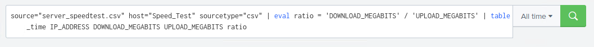

## Step 1: The Need for Speed
- Based on the report created, what is the approximate date and time of the attack? Attack started around 2/23/2020 at 14:30. You can see in the report the download speeds dropped to 1/10th of normal. 
- How long did it take your systems to recover? 9 hours to come back to normal downlaod speeds



## Step 2: Are We Vulnerable?


## Step 3: Drawing the (base)line
- When did the brute force attack occur? Attacked occured ``` 2/21/2020 from 0800 to 1400 ```
    
- Baseline of 20 failed logins an hour is what I determined for the alert


