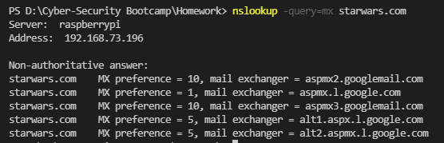

# Mission 1

#### Command ran to check MX records `nslookup -query=mx starwars.com `

#### Response from above command 

```
Non-authoritative answer:  
starwars.com    MX preference = 5, mail exchanger = alt1.aspx.l.google.com  
starwars.com    MX preference = 10, mail exchanger = aspmx2.googlemail.com  
starwars.com    MX preference = 1, mail exchanger = aspmx.l.google.com  
starwars.com    MX preference = 5, mail exchanger = alt2.aspmx.l.google.com  
starwars.com    MX preference = 10, mail exchanger = aspmx3.googlemail.com  
```



#### Problem statement
There are no MX records pointing to the new mail servers. 


#### Correct DNS Entry should be :

```  
starwars.com    MX preference = 1, mail exchanger = asltx.l.google.com
starwars.com    MX preference = 5, mail exchanger = asltx.2.google.com
```

# Mission 2

#### Command ran to check SPF records `nslookup -type=txt theforce.net` 

```
theforce.net    
    text = "v=spf1 a mx mx:smtp.secureserver.net include:aspmx.googlemail.com ip4:104.156.250.80 ip4:45.63.15.159 ip4:45.63.4.215"  
theforce.net  
    text ="google-site-verification=XTU_We07Cux-6WCSOItl0c_WS29hzo92jPE341ckbOQ"  
theforce.net    
    text ="google-site-verification=ycgY7mtk2oUZMagcffhFL_Qaf8Lc9tMRkZZSuig0d6w"
```


#### Problem statement:  
The new IP address for the mail server should be added to the SPF record. With the IP address missing from the SPF record, spam filters and appliances don't know if 
these are valid emails from that domain or if they are spoofed emails. 


#### Correct DNS Entry should be :
```
theforce.net  text = "v=spf1 a mx mx:smtp.secureserver.net include:aspmx.googlemail.com ip4:104.156.250.80 ip4:45.63.15.159 ip4:45.63.4.215 ip4:45.23.176.21" 
```

# Mission 3

#### Command ran to check MX records `nslookup -type=cname resistance.theforce.net`

```
*** raspberrypi can't find resistance.theforce.net: Non-existent domain
```


#### Problem statement : 
There is no cname record for resistance.theforce.net so a DNS lookup for where to go for that third level domain doesn't resolve.

#### Correct DNS Entry should be : 
resistance.theforce.net        canonical name = theforce.net

# Mission 4

#### Command ran  `nslookup -type=ns princessleia.site `

```
Non-authoritative answer:
princessleia.site       nameserver = ns25.domaincontrol.com
princessleia.site       nameserver = ns26.domaincontrol.com
```


#### Problem statement
Both nameservers are in the same location and are probably configured to replicate data between ns1 & ns2.


#### Add the backup DNS server to the NS entries for domain :

`princessleia.site       nameserver = ns2.galaxybackup.com`

# Mission 5

#### Shortest Route that doesn't include Planet N  
Batuu -> D -> C -> E -> F -> J -> K -> 0 -> R -> Q -> T -> V -> Jedha 

Route "cost" = 26

# Mission 6
Caller IP - 172.16.0.101  
Caller MAC - 00:13:ce:55:98:ef    
  
DHCP server IP: 172.16.0.1  
DHCP server MAC: 00:0f:66:e3:e4:01  


# Mission 7

#### Command ran  `nslookup -type=txt princessleia.site `

```
princessleia.site       text = "Run the following in a command line: telnet towel.blinkenlights.nl or as a backup access in a browser: www.asciimation.co.nz"
```

