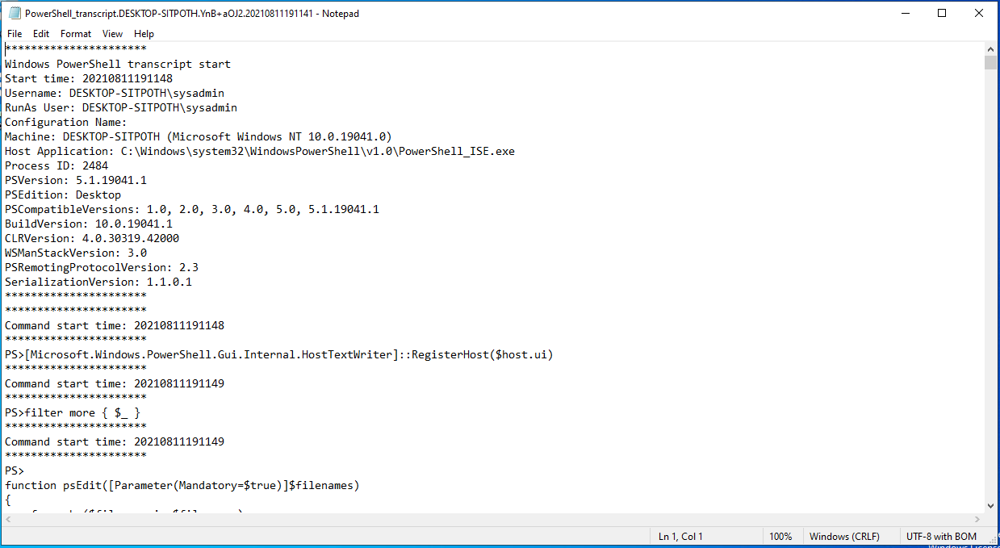

# Week 7 Homework: A Day in the Life of a Windows Sysadmin

#### Task 1  
 - 

#### Task 2
 - 

#### Task 3
 - 

#### Task 4  
```powershell
##Enumerate ACLs for files in a folder

$sourceDirectory = Read-Host "Enter directory to report Access Control List for contents:"

$directory = Get-ChildItem -Path $sourceDirectory

foreach ($item in $directory) 
{
   $Acl = Get-Acl -Path $item.FullName | Select-Object -Property path,owner -ExpandProperty access | Format-List
   Write-Output $Acl
}
```

#### Task 5
 - 