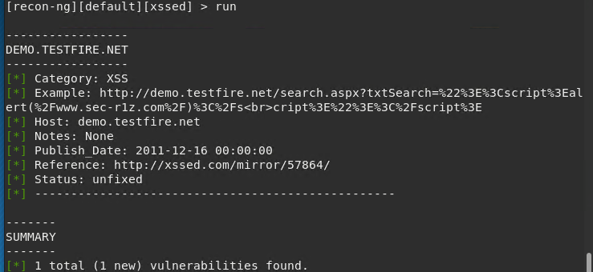

## Week 16 Homework Submission File: Penetration Testing 1

#### Step 1: Google Dorking


- Using Google, can you identify who the Chief Executive Officer of Altoro Mutual is: Karl Fitzgerald

- How can this information be helpful to an attacker: 
  - You can use this info to send phishing requests to employees of the company saying you are a certain executive and need something. You can also do a spear phishing attack on a executive of the company. 


#### Step 2: DNS and Domain Discovery

Enter the IP address for `demo.testfire.net` into Domain Dossier and answer the following questions based on the results:

  1. Where is the company located: Sunnyvale, CA

  2. What is the NetRange IP address: 65.61.137.64 - 65.61.137.127

  3. What is the company they use to store their infrastructure: Rackspace Backbone Engineering

  4. What is the IP address of the DNS server: 65.61.137.117 is the IP address of the site but the DNS servers are:
      * ASIA3.AKAM.NET
      * EUR2.AKAM.NET
      * EUR5.AKAM.NET
      * NS1-206.AKAM.NET
      * NS1-99.AKAM.NET
      * USC2.AKAM.NET
      * USC3.AKAM.NET
      * USW2.AKAM.NET

#### Step 3: Shodan

- What open ports and running services did Shodan find:
   * Ports Open
      * 80 - HTTP
      * 443 - HTTPS
      * 8080 - 
   * Services Running
      * Apache Tomcat/Coyote JSP engine

#### Step 4: Recon-ng

- Install the Recon module `xssed`. 
- Set the source to `demo.testfire.net`. 
- Run the module. 

Is Altoro Mutual vulnerable to XSS:  Yes



### Step 5: Zenmap

Your client has asked that you help identify any vulnerabilities with their file-sharing server. Using the Metasploitable machine to act as your client's server, complete the following:

- Command for Zenmap to run a service scan against the Metasploitable machine:  ``` nmap -sV -sC 192.168.0.10 ```
 
- Bonus command to output results into a new text file named `zenmapscan.txt`: ``` nmap -sV -sC -oN zenmapscan.txt 192.168.0.10 ```

- Zenmap vulnerability script command: ``` nmap --script smb-vuln-cve-2017-7494 192.168.0.10 ```

- Once you have identified this vulnerability, answer the following questions for your client:
  1. What is the vulnerability: Samba "username map script" Command Executioni

  2. Why is it dangerous: It is susceptible to attackers using shell characters in the username so they can execute commands

  3. What mitigation strategies can you recommendations for the client to protect their server: 
    * Upgrade the server to the latest version of Samba
    * Lock down the usage of Samba on the network to only "approved" devices that need to access that server