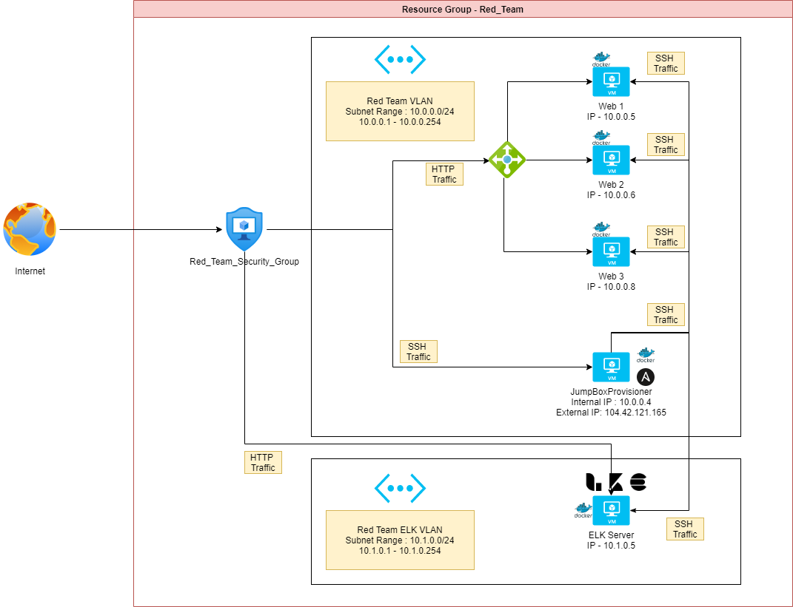
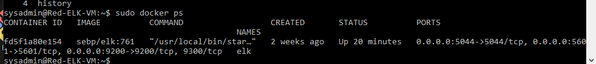

## Automated ELK Stack Deployment

The files in this repository were used to configure the network depicted below.

 

These files have been tested and used to generate a live ELK deployment on Azure. They can be used to either recreate the entire deployment pictured above. Alternatively, select portions of the ansible file may be used to install only certain pieces of it, such as Filebeat.

 [Playbook to install ELK stack](./install-elk.yml)

This document contains the following details:
- Description of the Topologu
- Access Policies
- ELK Configuration
  - Beats in Use
  - Machines Being Monitored
- How to Use the Ansible Build


### Description of the Topology

The main purpose of this network is to expose a load-balanced and monitored instance of DVWA, the D*mn Vulnerable Web Application.

Load balancing ensures that the application will be highly available, in addition to restricting management of the webservers to the network.
 - Load balancers deal with the Availabiity part of CIA security triad.
 - The Jump Box deals with the Integrity part of the CIA security triad. 
  
  Integrating an ELK server allows users to easily monitor the vulnerable VMs for changes to the server and hosted applicaotns along with system performance metrics.
- What does Filebeat watch for? Filebeat watches for changes in log files 
- What does Metricbeat record? Metricbeat collects metrics from the operating system and services running on the server.

The configuration details of each machine may be found below.

| Name                  | Function | IP Address | Operating System |
|-----------------------|----------|------------|------------------|
| JumpBoxProvisioner    | Gateway  | 10.0.0.4   | Linux            |
| Web-1                 | Web svr  | 10.0.0.5   | Linux            |
| Web-2                 | Web svr  | 10.0.0.6   | Linux            |
| Web=3                 | Web svr  | 10.0.0.8   | Linux            |
| Red-ELK-VM            | ELK svr  | 10.1.0.5   | Linux            |

### Access Policies

The machines on the internal network are not exposed to the public Internet. 

Only the Jumpbox machine can accept connections from the Internet. Access to this machine is only allowed from the following IP addresses:
- Add whitelisted IP addresses - {Your_External_IP} [Find your IP Address](https://www.whatsmyip.org/)

Machines within the network can only be accessed by the JumpBoxProvisioner server.
- Which machine did you allow to access your ELK VM? JumpBoxProvisioner
- What was its IP address? 10.0.0.4

A summary of the access policies in place can be found in the table below.

| Name                  | Publicly Accessible | Allowed IP Addresses          |
|-----------------------|---------------------|-------------------------------|
| JumpBoxProvisioner    | Yes but only SSH    | {Your_External_IP}            | 
| Web-1                 | No                  | 10.0.0.4                      | 
| Web-2                 | No                  | 10.0.0.4                      |  
| Web=3                 | No                  | 10.0.0.4                      | 
| Red-ELK-VM            | Yes but only HTTP   | 10.1.0.4, {Your_External_IP}  |
| Load Balancer         | Yes                 | {Your_External_IP}            | 

### Elk Configuration

Ansible was used to automate configuration of the ELK machine. No configuration was performed manually, which is advantageous because...
- What is the main advantage of automating configuration with Ansible? 
  - It speeds the time to get new servers out. 
  - It provides a audit trail of how the servers are configured. 
  - It lessens the chance of security issues due to a misconfiguration.

The playbook implements the following tasks:
- Installs Docker.IO
- Installs Python PIP3 module
- Installs Docker python module
- Increases the allocated memory for the container
- Downloads the ELK container docker image
- Sets docker to start upon bootup

The following screenshot displays the result of running ``` docker ps ``` after successfully configuring the ELK instance.



### Target Machines & Beats
This ELK server is configured to monitor the following machines:
- Web-1 : 10.0.0.5
- Web-2 : 10.0.0.6
- Web-3 : 10.0.0.8

We have installed the following Beats on these machines:
- Filebeats 
- Metricbeats

These Beats allow us to collect the following information from each machine:
- Filebeats which watches system logs and forwards any changes to the ELK server
- Metricbeats which monitor the Docker containers and forward the metrics from the containers to the ELK server

### Using the Playbook
In order to use the playbook, you will need to have an Ansible control node already configured. Assuming you have such a control node provisioned: 

SSH into the control node and follow the steps below:
1. Copy the install-elk.yml file to ``` /etc/ansible/ ```.
2. Update the file ``` /etc/ansible/hosts ``` file to include the ELK server under the [elk] meta tag. 
3. Run the playbook, and navigate to http://{SEVER_PUBLIC_IP_ADDR}:5601/app/kibana#/home 
  
#### Questions
1. Which file is the playbook? install-elk.yml
2. Where do you copy it? Copy it to ``` /etc/ansible ``` directory on the Ansible docker container running on the jump box
3. Which file do you update to make Ansible run the playbook on a specific machine? hosts file in the ``` /etc/ansible/ ``` directory 
4. How do I specify which machine to install the ELK server on versus which to install Filebeat on? In the ansible script you set which set of servers the script runs on. In this case the "hosts" value is set to "webservers" which is the meta tag that the web servers ip addresses are defined under.
5. Which URL do you navigate to in order to check that the ELK server is running? http://{SEVER_PUBLIC_IP_ADDR}:5601/app/kibana#/home


