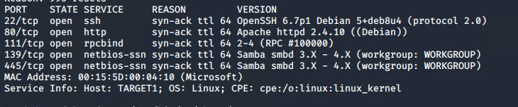

# Red Team: Summary of Operations

## Table of Contents
- Exposed Services
- Critical Vulnerabilities
- Exploitation

### Exposed Services
_TODO: Fill out the information below._

Nmap scan results for each machine reveal the below services and OS details:

```bash
$ nmap ... nmap -vv -Pn -sV -R 192.168.1.110
  
```
 

This scan identifies the services below as potential points of entry:
- Target 1
  - List of
  - Exposed Services
  -  


The following vulnerabilities were identified on each target:
- Target 1
  - List of
  - Critical
  - Vulnerabilities
  - CVE-2015-5600 - SSH brute force attacks
  - CVE-2020-14145 - SSH Man in the middle attacks
  - 

_TODO: Include vulnerability scan results to prove the identified vulnerabilities._

### Exploitation
The Red Team was able to penetrate `Target 1` and retrieve the following confidential data:
- Target 1
  - `flag1.txt`: flag1{b9bbcb33e11b80be759c4e844862482d}
    - **Exploit Used**
    - I found this flag by just scanning the web pages source code.
    - 
  - `flag2.txt`: flag2{fc3fd58dcdad9ab23faca6e9a36e581c}
  - 
    - **Exploit Used**
    
    
    

    Cracked Wordpress users password
    


  - `flag4.txt`:  
  - 
    - **Exploit Used**
      - Elevated user to root with folloing Python command
     